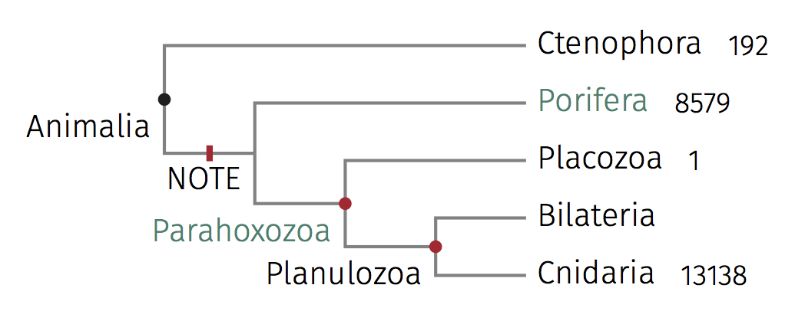

# Create phylogenetics trees by xelatex/tikz/forest.

## A picture is worth a thousand words



## Manually create tikz/forest files

```bash
perl forest.pl forest/test.forest -t translation/translation.csv -a
```

will create `forest/test.trans.tex`.

Add `--pdf` or `-p` will create `.tex` and `.pdf`.

## Convert newick to tikz/forest file

Create `tree/hg38.7way.commonNames.forest` by

```bash
perl tree.pl tree/hg38.7way.commonNames.nh
```

Edit this file if needed. Then create pdfs.

```bash
perl forest.pl tree/hg38.7way.commonNames.forest -r -p
```

Or in one line, will create `./output.pdf`.

```bash
perl tree.pl tree/hg38.7way.commonNames.nh -o stdout \
    | perl forest.pl stdin -r -p

```

## Create common tree from NCBI

* On the homepage of [NCBI Taxonomy](http://www.ncbi.nlm.nih.gov/taxonomy), click the link of
[Common Tree](http://www.ncbi.nlm.nih.gov/Taxonomy/CommonTree/wwwcmt.cgi).

* Create a local plain text file, paste all the scientific names of desired into it.
Use `Browse...` and `Add from file:` buttons to upload the newly created file.

* Choose `phylip tree` then click the button of `Save as`.

* A file with default name `phyliptree.phy` created.
Edit it with Dendroscope and export as a .newick file.

```bash
perl tree.pl tree/Oleaceae.newick
cp tree/Oleaceae.forest forest/
```

* Edit `forest/Oleaceae.forest` manually.

    * Replace tribe labels with chromosome numbers.

    * Replace tribe dots with bars.

    * Sort genera by names.

```bash
perl forest.pl forest/Oleaceae.forest -t translation/translation.csv -a -p
```

## Dependences

* LaTeX (I use MacTex 2015/2016)
* LaTeX packages
    * XeLaTeX
    * xeCJK
    * Tikz
    * Forest
* Perl
* Perl modules
    * Path::Tiny
    * Bio::Phylo
