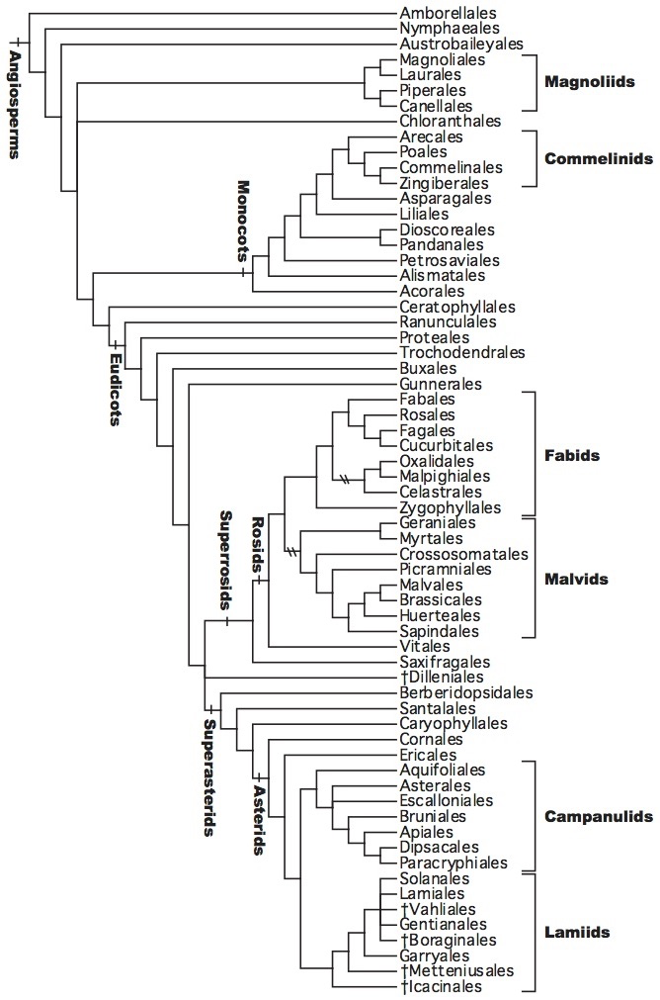
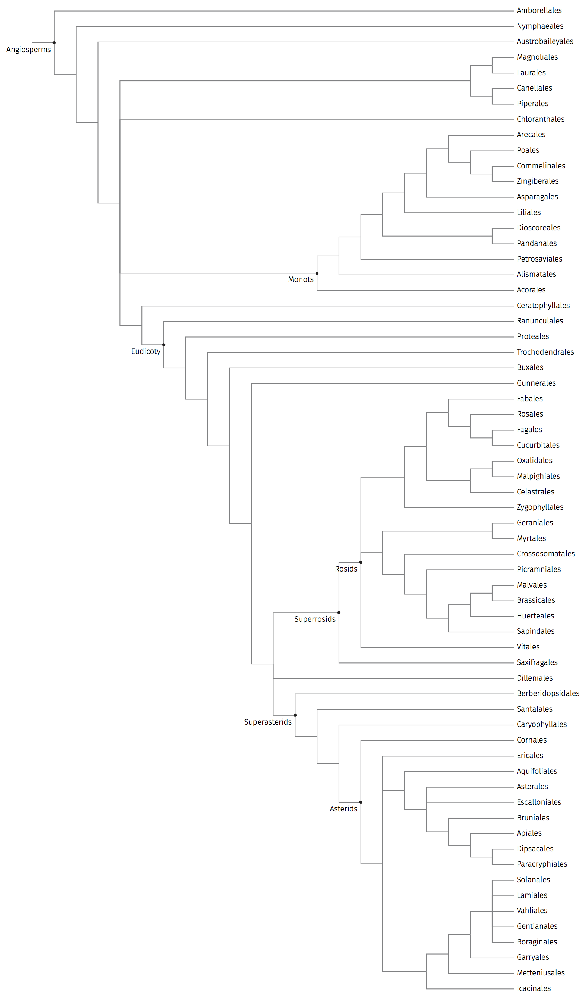

# Create phylogenetic trees by xelatex/tikz/forest.

[TOC levels=1-3]: # " "
- [Create phylogenetic trees by xelatex/tikz/forest.](#create-phylogenetic-trees-by-xelatextikzforest)
- [A picture is worth a thousand words](#a-picture-is-worth-a-thousand-words)
- [Tex/pdf files from manually created tikz/forest files](#texpdf-files-from-manually-created-tikzforest-files)
- [Starting from a newick tree](#starting-from-a-newick-tree)
- [Create common tree from NCBI](#create-common-tree-from-ncbi)
- [The APG IV system of flowering plant classification](#the-apg-iv-system-of-flowering-plant-classification)
- [Why not FigTree/Dendroscope/MEGA?](#why-not-figtreedendroscopemega)
- [Dependences](#dependences)


# A picture is worth a thousand words


# Tex/pdf files from manually created tikz/forest files

[A forest file](forest/test.forest) looks like this:

```text
[, label=Opisthokonta, dot
    [, tier=1
        [Nucleariida]
        [Fungi]
    ]
    [, label=Holozoa, dot
        [Filasterea]
        [Ichthosporea]
        [, tier=1
            [\color{red}{Animals}]
            [Choanoflagellata]
        ]
    ]
]
```

The following command will create `forest/test.trans.tex`.

```bash
perl forest.pl forest/test.forest -t translation/translation.csv -a
```

Adding `-p` will also create `.pdf`.


# Starting from a newick tree

Get a newick file from UCSC

```bash
curl http://hgdownload.cse.ucsc.edu/goldenpath/hg38/multiz7way/hg38.7way.commonNames.nh \
    > tree/hg38.7way.commonNames.nh
```

Create `tree/hg38.7way.commonNames.forest` by

```bash
perl tree.pl tree/hg38.7way.commonNames.nh
```

Edit this file if needed, such as adding annotations for nodes and branches, adding comments or
adjusting colors.

Then create pdfs.

```bash
perl forest.pl tree/hg38.7way.commonNames.forest -r -p
```

With branch lengthes.

```bash
perl tree.pl tree/hg38.7way.commonNames.nh -w -o stdout \
    | perl forest.pl stdin -r -p
```

Or in one line, will create [`output.pdf`](example/output.pdf).

```bash
curl http://hgdownload.cse.ucsc.edu/goldenpath/hg38/multiz100way/hg38.100way.scientificNames.nh \
    | perl tree.pl stdin -o stdout \
    | perl forest.pl stdin -r -p
```

# Create common tree from NCBI

* On the homepage of [NCBI Taxonomy](http://www.ncbi.nlm.nih.gov/taxonomy), click the link of
  [Common Tree](http://www.ncbi.nlm.nih.gov/Taxonomy/CommonTree/wwwcmt.cgi).

* Create a local plain text file, paste all the scientific names of desired into it. Use `Browse...`
  and `Add from file:` buttons to upload the newly created file.

* Choose `phylip tree` then click the button of `Save as`.

* A file with default name `phyliptree.phy` created. Edit it with Dendroscope and export as a
  .newick file.

```bash
perl tree.pl tree/Oleaceae.newick
cp tree/Oleaceae.forest forest/
```

* Edit `forest/Oleaceae.forest` manually.

    * Replace tribe labels with chromosome numbers.

    * Replace tribe dots with bars.

    * Sort genera by names.

```bash
perl forest.pl forest/Oleaceae.forest -t translation/translation.csv -a -p
```

# The APG IV system of flowering plant classification

This is Fig. 1 of [the APG IV paper](http://dx.doi.org/10.1111%2Fboj.12385):



We recreated it by the following steps:

1. create [this newick file](tree/APG_IV.newick) manually (indented by newick-tools)

2. convert .newick to .forest

    ```bash
    perl tree.pl tree/APG_IV.newick && cp tree/APG_IV.forest forest/
    ```

3. create .pdf from .forest

    ```bash
    perl forest.pl forest/APG_IV.forest -p
    ```

And we got this:



# Why not FigTree/Dendroscope/MEGA?

For full controls on the tree, fonts, colors, line widths, annotations, etc.

The figure below is a result file opened in Adobe Illustrator. Very clean vector graphics.


# Dependences

* LaTeX (I use MacTex 2015/2016/2017)
* LaTeX utilities
    * XeLaTeX
    * latexmk
* LaTeX packages
    * xeCJK
    * TikZ
    * Forest
* Perl
* Perl modules
    * Path::Tiny
    * Bio::Phylo
