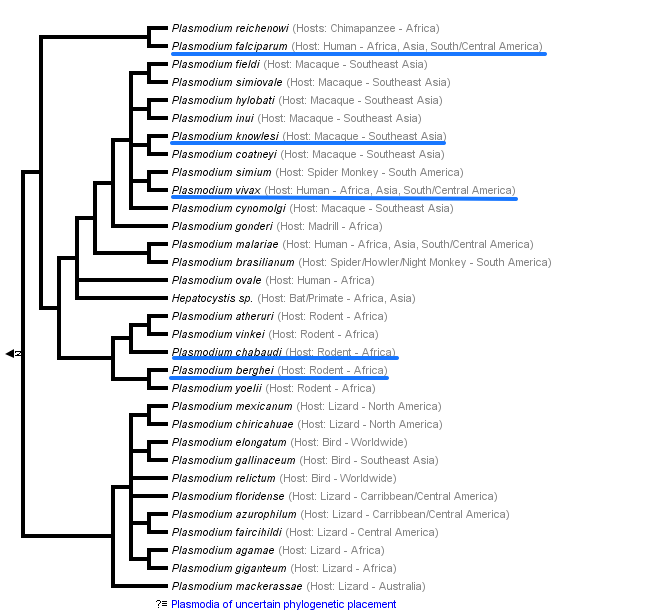

# Phylogenetic Trees

[TOC]: # " "

- [*Dictyostelium*](#dictyostelium)
- [Yeast](#yeast)
- [*Saccharomycetaceae*](#saccharomycetaceae)
- [*Aspergillus*](#aspergillus)
- [Fungi](#fungi)
- [*Caenorhabditis*](#caenorhabditis)
- [*Drosophila*](#drosophila)
- [*Oryza*](#oryza)
- [*Primates*](#primates)
- [*Plasmodium*](#plasmodium)
- [Plants](#plants)
- [Tree of Life](#tree-of-life)

## *Dictyostelium*

From [here](http://dev.biologists.org/content/138/3/387).

## Yeast

## *Saccharomycetaceae*

## *Aspergillus*

## Fungi

## *Caenorhabditis*

## *Drosophila*

## *Oryza*

## *Primates*

From [here](https://doi.org/10.1016/j.tig.2005.06.012)

## *Plasmodium*

## Plants

From [here](http://nypg.bio.nyu.edu/bp/?q=node/6)

## Tree of Life

