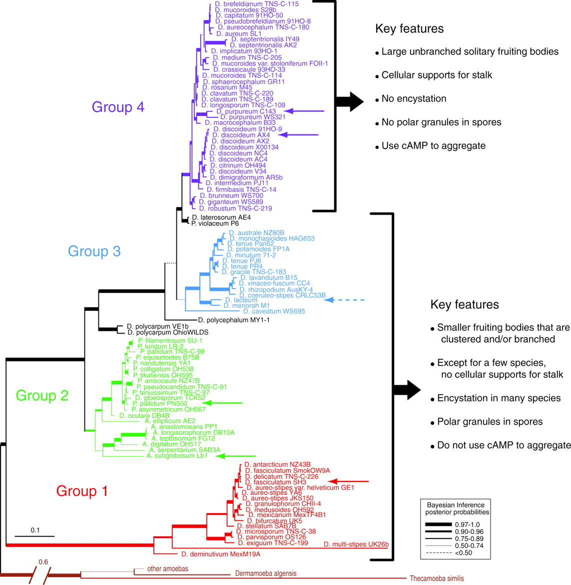

# Phylogenetic Trees

[TOC]: # " "
- [*Dictyostelium*](#dictyostelium)
- [Yeast](#yeast)
- [*Saccharomycetaceae*](#saccharomycetaceae)
- [*Aspergillus*](#aspergillus)
- [*Caenorhabditis*](#caenorhabditis)
- [*Oryza*](#oryza)

## *Dictyostelium*

From [here](http://dev.biologists.org/content/138/3/387).

## Yeast

## *Saccharomycetaceae*

## *Aspergillus*

## *Caenorhabditis*

## *Oryza*

